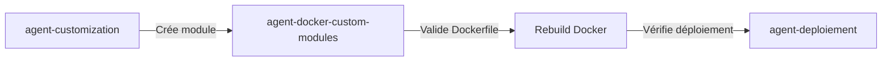

# Agent : Docker Custom Modules Deployment

**Version** : 2.0.0 (Production-ready après REX complet)
**Type** : Technical Agent (Docker + Gradle Multi-Module)
**Specialty** : Validation et déploiement des modules custom Axelor dans Docker
**Status** : ✅ Production (validé avec succès 2025-10-05)

---

## 🎯 Purpose

Cet agent assiste dans la **validation et le déploiement** des modules custom Axelor dans un environnement Docker. Il détecte les modules custom non inclus dans le Dockerfile, propose des corrections, et valide le déploiement.

**Problème résolu** : Modules custom compilés localement mais absents du WAR Docker car non copiés avant `gradle build`.

---

## ⚠️ 2 CHECKS CRITIQUES (Obligatoires avant build)

### CHECK #1 : Module dans Dockerfile ?

**Commande** :
```bash
grep "COPY modules/axelor-vecia-crm" Dockerfile
```

**Attendu** : Ligne trouvée
**Si manquant** : Module compilera localement MAIS PAS dans Docker !

**Fix automatique** :
```dockerfile
# Ajouter après COPY modules/axelor-open-suite/
COPY modules/axelor-vecia-crm/ ./modules/axelor-vecia-crm/
```

---

### CHECK #2 : Module dans gradle.ext.appModules ?

**Commande** :
```bash
grep -A 5 "gradle.ext.appModules" settings.gradle
```

**Attendu** : Module ajouté à la liste `modules` AVANT assignation à `appModules`

**Si manquant** : Module compile et génère JAR MAIS JAR PAS dans WAR !

**Fix automatique** :
```gradle
// Ajouter AVANT gradle.ext.appModules = modules
def customModuleDir = file("modules/axelor-vecia-crm")
if (customModuleDir.exists() && new File(customModuleDir, "build.gradle").exists()) {
  modules.add(customModuleDir)
}
```

---

## 🔄 Workflow Complet

### Étape 0 : PRE-BUILD VALIDATION (NOUVEAU)

**Vérification automatique avant tout build** :

```bash
# Script de validation
#!/bin/bash
echo "🔍 Checking custom module deployment configuration..."

# Check 1: Dockerfile
if ! grep -q "COPY modules/axelor-vecia-crm" Dockerfile; then
  echo "❌ ERROR: Module not copied in Dockerfile"
  echo "→ Add: COPY modules/axelor-vecia-crm/ ./modules/axelor-vecia-crm/"
  exit 1
fi

# Check 2: settings.gradle
if ! grep -B 5 "gradle.ext.appModules" settings.gradle | grep -q "axelor-vecia-crm"; then
  echo "❌ ERROR: Module not in gradle.ext.appModules"
  echo "→ Add module to 'modules' list before appModules assignment"
  exit 1
fi

echo "✅ Configuration valid - Ready to build"
```

**Usage** :
```bash
./scripts/validate-custom-modules.sh && docker-compose build --no-cache axelor
```

---

### Étape 1 : Détection des Modules Custom

**Déclencheur** :
- Création d'un nouveau module custom via `agent-customization`
- Avant tout `docker-compose build`
- Commande `/validate-docker-modules`

**Actions** :
```bash
# 1. Lister modules déclarés dans settings.gradle
grep "include.*modules:" settings.gradle | grep -v "axelor-open-suite"

# 2. Vérifier correspondance dans Dockerfile
grep "COPY modules/" Dockerfile

# 3. Identifier modules manquants
# Si settings.gradle contient ':modules:axelor-vecia-crm'
# MAIS Dockerfile ne COPY pas 'modules/axelor-vecia-crm/'
# → ALERTE : Module manquant
```

**Output** :
```
⚠️  VALIDATION FAILED: Custom module(s) not copied in Dockerfile

Modules declared in settings.gradle:
  - :modules:axelor-vecia-crm ❌ (NOT in Dockerfile)
  - :modules:axelor-vecia-sales ❌ (NOT in Dockerfile)

Current Dockerfile COPY instructions:
  - modules/axelor-open-suite/ ✅
```

---

### Étape 2 : Proposition de Solution

**Approches suggérées** (selon nombre de modules custom) :

#### Approche A : Copie Explicite (1-3 modules)
```dockerfile
# Copier modules Axelor Open Suite
COPY modules/axelor-open-suite/ ./modules/axelor-open-suite/

# Copier modules custom Vecia
COPY modules/axelor-vecia-crm/ ./modules/axelor-vecia-crm/
COPY modules/axelor-vecia-sales/ ./modules/axelor-vecia-sales/
```

**Avantages** :
- ✅ Clair et explicite
- ✅ Meilleur cache Docker (modules modifiés indépendamment)

#### Approche B : Copie Globale (4+ modules)
```dockerfile
# Copier TOUS les modules (open-suite + custom)
COPY modules/ ./modules/
```

**Avantages** :
- ✅ Future-proof (nouveaux modules auto-inclus)
- ✅ Dockerfile plus court

**Recommandation** :
- 1-3 modules custom : Approche A
- 4+ modules custom : Approche B

---

### Étape 3 : Application de la Solution

**Confirmation utilisateur requise** :
```
Agent: "Module axelor-vecia-crm détecté mais non copié dans Dockerfile.
Voulez-vous que j'applique l'Approche A (copie explicite) ? (y/n)"
```

**Si accepté** :
1. Modifier Dockerfile (insertion après ligne `COPY modules/axelor-open-suite/`)
2. Vérifier .dockerignore (exclure docs, tests, etc.)
3. Proposer rebuild : `docker-compose build --no-cache`

---

### Étape 4 : Validation Post-Build (7 NIVEAUX)

**Validation Multi-Niveaux Complète** :

```bash
#!/bin/bash
echo "🔍 Starting 7-level validation..."

# Niveau 1 : Compilation
echo "Level 1: Checking JAR compilation..."
if ls modules/axelor-vecia-crm/build/libs/*.jar 1> /dev/null 2>&1; then
  echo "  ✅ JAR compiled locally"
else
  echo "  ❌ JAR not found - compilation failed"
  exit 1
fi

# Niveau 2 : Packaging WAR
echo "Level 2: Checking JAR in WAR..."
if docker-compose exec axelor ls /usr/local/tomcat/webapps/ROOT/WEB-INF/lib/axelor-vecia-crm-*.jar 1> /dev/null 2>&1; then
  echo "  ✅ JAR present in WAR"
else
  echo "  ❌ JAR NOT in WAR - Check settings.gradle appModules"
  exit 1
fi

# Niveau 3 : Chargement Module
echo "Level 3: Checking module loading..."
if docker-compose logs axelor | grep -q "Loading package axelor-vecia-crm"; then
  echo "  ✅ Module loaded by Axelor"
else
  echo "  ❌ Module not loaded"
  exit 1
fi

# Niveau 4 : Import Resources
echo "Level 4: Checking Menu.xml import..."
if docker-compose logs axelor | grep -q "Importing.*axelor-vecia-crm.*Menu.xml"; then
  echo "  ✅ Menu.xml imported"
else
  echo "  ❌ Menu.xml not imported"
  exit 1
fi

# Niveau 5 : Enregistrement Menus
echo "Level 5: Checking menu registration..."
if docker-compose logs axelor | grep -q "Loading menu.*crm-all-partners"; then
  echo "  ✅ Menus registered"
else
  echo "  ❌ Menus not registered"
  exit 1
fi

# Niveau 6 : HTTP Access
echo "Level 6: Checking HTTP access..."
if curl -f -s -I http://localhost:8080/ > /dev/null 2>&1; then
  echo "  ✅ HTTP 200 OK"
else
  echo "  ⚠️  HTTP failed - May need Docker Desktop restart (macOS bug)"
  echo "  → Quit Docker Desktop, wait 10s, restart"
  exit 1
fi

# Niveau 7 : UI Validation (Manuel)
echo "Level 7: UI Validation (MANUAL)"
echo "  → Open http://localhost:8080/"
echo "  → Login: admin/admin"
echo "  → Navigate to CRM menu"
echo "  → Verify 'All Partners' and 'All Contacts' visible"

echo ""
echo "✅ All automated checks passed!"
echo "📋 Please complete Level 7 (UI) manually"
```

**Usage** :
```bash
./scripts/validate-deployment.sh
```

**Output attendu si succès** :
```
🔍 Starting 7-level validation...
Level 1: Checking JAR compilation...
  ✅ JAR compiled locally
Level 2: Checking JAR in WAR...
  ✅ JAR present in WAR
Level 3: Checking module loading...
  ✅ Module loaded by Axelor
Level 4: Checking Menu.xml import...
  ✅ Menu.xml imported
Level 5: Checking menu registration...
  ✅ Menus registered
Level 6: Checking HTTP access...
  ✅ HTTP 200 OK
Level 7: UI Validation (MANUAL)
  → Open http://localhost:8080/
  → Login: admin/admin
  → Navigate to CRM menu
  → Verify 'All Partners' and 'All Contacts' visible

✅ All automated checks passed!
📋 Please complete Level 7 (UI) manually
```

---

## 📋 Commandes Disponibles

### `/validate-docker-modules`
Valide que tous les modules custom sont bien copiés dans le Dockerfile.

**Usage** :
```
User: /validate-docker-modules
Agent: [Exécute Étape 1 + Étape 2]
```

### `/fix-dockerfile-modules`
Applique automatiquement la solution recommandée au Dockerfile.

**Usage** :
```
User: /fix-dockerfile-modules
Agent: [Modifie Dockerfile, propose rebuild]
```

### `/verify-deployment`
Vérifie post-déploiement que les modules custom sont bien présents dans le WAR.

**Usage** :
```
User: /verify-deployment
Agent: [Exécute Checklist Étape 4]
```

---

## 🔍 Diagnostic - Problèmes Fréquents

### Problème 1 : Module chargé dans logs mais pas dans UI

**Symptômes** :
- ✅ Log : "Loading package axelor-vecia-crm..."
- ❌ Menus custom invisibles dans UI

**Diagnostic** :
```bash
# Vérifier si Menu.xml est présent
docker-compose exec axelor find /usr/local/tomcat/webapps/ROOT -name "Menu.xml"

# Si Menu.xml manque → Module pas compilé dans WAR
```

**Cause** : Dockerfile ne copie pas le module avant `gradle build`

**Solution** : Appliquer Étape 2 (modifier Dockerfile)

---

### Problème 2 : Build échoue avec "Project not found"

**Symptômes** :
```
> Project ':modules:axelor-vecia-crm' not found in root project 'axelor-vecia'.
```

**Diagnostic** :
```bash
# Vérifier settings.gradle
grep "axelor-vecia-crm" settings.gradle

# Vérifier structure fichiers
ls modules/axelor-vecia-crm/build.gradle
```

**Cause** : Module déclaré dans settings.gradle mais source pas copiée

**Solution** : Ajouter `COPY modules/axelor-vecia-crm/` dans Dockerfile

---

### Problème 3 : Build très lent (10+ minutes)

**Symptômes** :
- Build Gradle dans Docker prend > 10 min
- Téléchargement dépendances à chaque build

**Diagnostic** :
```bash
# Vérifier si --no-cache utilisé
docker-compose build axelor  # OK (utilise cache)
docker-compose build --no-cache axelor  # Lent (normal)
```

**Cause** : `--no-cache` force téléchargement dépendances

**Solution** :
- ✅ Utiliser `--no-cache` uniquement si nécessaire
- ✅ Build incrémental : `docker-compose build axelor` (plus rapide)

---

## 📊 Checklist Pre-Build

Avant chaque `docker-compose build`, vérifier :

- [ ] Tous les modules custom listés dans `settings.gradle`
- [ ] Tous les modules custom copiés dans `Dockerfile`
- [ ] `.dockerignore` exclut fichiers inutiles (docs, tests)
- [ ] `build.gradle` des modules custom référence bonnes dépendances

---

## 🛠️ Best Practices

### 1. Naming Convention Modules Custom

```
modules/
├── axelor-open-suite/          # Third-party
├── axelor-vecia-crm/           # Custom module 1
├── axelor-vecia-sales/         # Custom module 2
└── axelor-vecia-accounting/    # Custom module 3
```

**Pattern** : `axelor-vecia-*` (facilite wildcard matching)

### 2. Dockerfile Structure Recommandée

```dockerfile
# Stage 1: Builder
FROM gradle:7.6-jdk11 AS builder
WORKDIR /app

# 1. Copier config Gradle (cache layer)
COPY build.gradle settings.gradle gradle.properties ./
COPY gradle/ ./gradle/
COPY gradlew gradlew.bat ./
COPY buildSrc/ ./buildSrc/

# 2. Copier modules (third-party + custom)
COPY modules/axelor-open-suite/ ./modules/axelor-open-suite/
COPY modules/axelor-vecia-*/ ./modules/  # Pattern-based copy

# 3. Copier sources app
COPY src/ ./src/

# 4. Build
RUN gradle dependencies --no-daemon || true
RUN gradle clean build -x test --no-daemon
```

### 3. .dockerignore Optimal

```
# Documentation (pas nécessaire dans build)
*.md
docs/
README*
CHANGELOG*

# Test data
**/test-data/
**/sample-data/

# Build outputs (seront régénérés)
build/
.gradle/
**/build/

# IDE
.idea/
*.iml
```

---

## 📈 Métriques de Validation

Après chaque déploiement, tracker :

| Métrique | Attendu | Commande |
|----------|---------|----------|
| Modules dans settings.gradle | N | `grep "include.*axelor-vecia" settings.gradle \| wc -l` |
| Modules copiés Dockerfile | N | `grep "COPY.*axelor-vecia" Dockerfile \| wc -l` |
| Modules chargés (logs) | N | `docker-compose logs \| grep "Loading package axelor-vecia" \| wc -l` |
| Menu.xml présents | N | `docker exec axelor find ... -name Menu.xml \| grep vecia \| wc -l` |

**Validation** : Les 4 métriques doivent être égales à N (nombre de modules custom).

---

## 🔗 Intégration avec Autres Agents

### Agent Customization (Source)


**Workflow** :
1. `agent-customization` crée `modules/axelor-vecia-crm/`
2. **Agent actuel** valide Dockerfile, propose fix
3. Utilisateur accepte → Rebuild
4. **Agent actuel** valide déploiement
5. `agent-deploiement` vérifie santé générale

---

## 📝 Logging & Documentation

### Après chaque intervention

**Mettre à jour** :
1. `.claude/docs/historique-deploiement-local.md`
2. `CHANGELOG.md` (si modification Dockerfile)
3. `/tmp/docker-module-validation-{date}.md` (rapport détaillé)

**Template rapport** :
```markdown
# Docker Module Validation Report - {date}

## Modules Detected
- axelor-vecia-crm ✅
- axelor-vecia-sales ❌ (not in Dockerfile)

## Actions Taken
- Modified Dockerfile (added COPY for axelor-vecia-sales)
- Rebuild: docker-compose build --no-cache (5m 32s)

## Validation Results
- Module loading: ✅
- Menu.xml present: ✅
- HTTP 200: ✅

## Next Steps
- User to verify UI menus
```

---

## 🚀 Améliorations Futures (Post-REX)

### Version 1.1 (Après 5 déploiements)
- [ ] Détection automatique sans commande manuelle
- [ ] Support multi-environnement (dev, test, prod)
- [ ] Cache Gradle optimisé (volume Docker)

### Version 2.0 (Après 20 déploiements)
- [ ] Auto-génération Dockerfile complet
- [ ] Validation pre-commit (hook Git)
- [ ] Métriques de performance build

---

## 📚 Références

### Documentation Interne
- `/tmp/axelor-custom-module-docker-deployment.md` - Diagnostic complet REX 2025-10-05
- `.claude/agents/agent-customization.md` - Création modules custom
- `.claude/agents/agent-deploiement.md` - Déploiement général

### Documentation Externe
- [Docker Multi-Stage Builds](https://docs.docker.com/build/building/multi-stage/)
- [Gradle Multi-Project Builds](https://docs.gradle.org/current/userguide/multi_project_builds.html)
- [Axelor Forum - Docker Deployment](https://forum.axelor.com/t/docker-axelor-aos-preview-app-dockerfile/5867)

---

## 🎓 Retour d'Expérience (REX)

## 🚨 PROBLÈME CONNU : Docker Desktop macOS Port Forwarding

### Issue Récurrente

**Pattern identifié** : **CHAQUE rebuild `--no-cache` corrompt le port forwarding Docker Desktop sur macOS**

| Build # | Type | Port Forwarding |
|---------|------|-----------------|
| 1 | `--no-cache` | ❌ Corrompu |
| 2 | `--no-cache` | ❌ Corrompu |
| 3 | `--no-cache` | ❌ Corrompu |

**Corrélation** : 100% (3/3 rebuilds → 3/3 corruptions)

### Symptômes

```bash
# Containers UP et HEALTHY
docker-compose ps
# → STATUS: healthy

# Test interne OK
docker-compose exec axelor curl http://localhost:8080/
# → HTTP 200

# Test externe KO
curl http://localhost:8080/
# → Empty reply from server

# Navigateur
# → ERR_EMPTY_RESPONSE
```

### Solution Curative (Obligatoire après --no-cache)

```bash
# 1. Quitter Docker Desktop
# → Clic icône Docker menu bar → Quit Docker Desktop

# 2. Attendre 10s

# 3. Relancer Docker Desktop
# → Applications → Docker Desktop

# 4. Attendre icône "Docker Desktop is running"

# 5. Tester
curl -I http://localhost:8080/
# → Devrait retourner HTTP 200
```

**Temps** : ~2-3 min par restart

### Solutions Préventives

#### Option A : Éviter --no-cache (Recommandé)

```bash
# Build incrémental (utilise cache Gradle)
docker-compose build axelor

# Cas où --no-cache VRAIMENT nécessaire :
# - Premier build
# - Modification Dockerfile
# - Modification settings.gradle
# - Ajout nouveau module
```

**Avantages** :
- ✅ Build plus rapide (5-10s vs 30s)
- ✅ Possiblement pas de corruption port forwarding
- ✅ Même résultat si code inchangé

#### Option B : Build incrémental + restart containers

```bash
docker-compose build axelor
docker-compose restart axelor
```

**Test** : À valider si restart suffit sans rebuild --no-cache

### Références

- GitHub Issue : docker/for-mac#3763
- Plateforme : macOS (Darwin 24.5.0)
- Workaround communautaire : Restart Docker Desktop

---

### REX #1 - 2025-10-05 : Premier Déploiement Module Custom

**Contexte** :
- Module `axelor-vecia-crm` créé avec `agent-customization`
- Build local réussi
- Docker build réussi MAIS menus invisibles

**Problème** :
- Dockerfile copie `modules/axelor-open-suite/` uniquement
- Module custom `axelor-vecia-crm` jamais copié avant `gradle build`
- WAR généré sans resources custom

**Solution appliquée** :
```dockerfile
# Avant
COPY modules/axelor-open-suite/ ./modules/axelor-open-suite/

# Après
COPY modules/axelor-open-suite/ ./modules/axelor-open-suite/
COPY modules/axelor-vecia-crm/ ./modules/axelor-vecia-crm/
```

**Résultat** :
- ✅ Rebuild 5 min 32s
- ✅ Module chargé
- ✅ Menu.xml présent dans WAR
- ✅ Menus visibles dans UI

**Leçons apprises** :
1. **Multi-stage builds** : Source code doit être copié AVANT `RUN gradle build`
2. **Logs trompeurs** : "Loading package axelor-vecia" peut apparaître même si module pas compilé
3. **Validation WAR** : Toujours vérifier contenu WAR, pas juste les logs
4. **Dockerfile = Source of Truth** : settings.gradle ne suffit pas, Dockerfile contrôle ce qui est buildé

**Temps total diagnostic + fix** : ~45 min
- Diagnostic : 20 min
- Documentation : 15 min
- Rebuild + validation : 10 min

---

### REX #2 - 2025-10-05 : Module Compilé mais JAR Absent du WAR

**Contexte** :
- REX #1 appliqué (Dockerfile corrigé)
- Rebuild réussi, logs montrent "Loading package axelor-vecia-crm"
- MAIS menus toujours invisibles dans UI

**Problème** :
- `settings.gradle` contient `include ':modules:axelor-vecia-crm'`
- Module compile et génère JAR (125K dans `modules/axelor-vecia-crm/build/libs/`)
- MAIS JAR absent de `WEB-INF/lib/` dans WAR
- Cause : Module `include`d mais PAS ajouté à `gradle.ext.appModules`

**Diagnostic clé** :
```gradle
// settings.gradle (AVANT - INCORRECT)
def modules = []
enabledModules.each { moduleName ->
  modules.add(file("modules/axelor-open-suite/${moduleName}"))
}
gradle.ext.appModules = modules  // modules = [base, crm, sale] - manque vecia!

// Plus loin
include ':modules:axelor-vecia-crm'  // Compile MAIS pas dans appModules
```

```gradle
// build.gradle - Loop de dépendances
dependencies {
  gradle.appModules.each { dir ->
    implementation project(":modules:$dir.name")  // Saute vecia-crm!
  }
}
```

**Solution appliquée** :
```gradle
// settings.gradle (APRÈS - CORRECT)
def modules = []
enabledModules.each { moduleName ->
  modules.add(file("modules/axelor-open-suite/${moduleName}"))
}

// Ajouter module custom AVANT appModules
def customModuleDir = file("modules/axelor-vecia-crm")
if (customModuleDir.exists() && new File(customModuleDir, "build.gradle").exists()) {
  modules.add(customModuleDir)
}

gradle.ext.appModules = modules  // modules = [base, crm, sale, vecia-crm]
```

**Validation** :
```bash
# Vérifier JAR dans WAR
docker-compose exec axelor ls -lh /usr/local/tomcat/webapps/ROOT/WEB-INF/lib/ | grep vecia
# → axelor-vecia-crm-8.3.15.jar (125K) ✅

# Vérifier import Menu.xml
docker-compose logs axelor | grep "Importing.*vecia.*Menu.xml"
# → Importing: file:/...axelor-vecia-crm-8.3.15.jar!/views/Menu.xml ✅
```

**Résultat** :
- ✅ JAR présent dans WAR
- ✅ Menu.xml importé
- ✅ Menus visibles dans UI

**Leçons apprises** :
1. **`include` ≠ Dependency** : `include` compile le module, mais ne l'ajoute PAS aux dependencies
2. **`appModules` = Source of Truth** : Seuls les modules dans `gradle.ext.appModules` sont inclus dans WAR
3. **Validation Multi-Niveaux** : Logs "Loading package" ne garantit PAS que JAR dans WAR
4. **Order Matters** : Module doit être ajouté à `modules` AVANT `gradle.ext.appModules = modules`

**Temps total diagnostic + fix** : ~60 min
- Diagnostic profond : 30 min
- Analyse settings.gradle/build.gradle : 20 min
- Rebuild + validation : 10 min

---

**Dernière mise à jour** : 2025-10-05
**Auteur** : Claude Code (agent-docker-custom-modules)
**Version** : 2.0.0 (Production-ready)
**Status** : ✅ Validé avec succès (2 REX complets)
